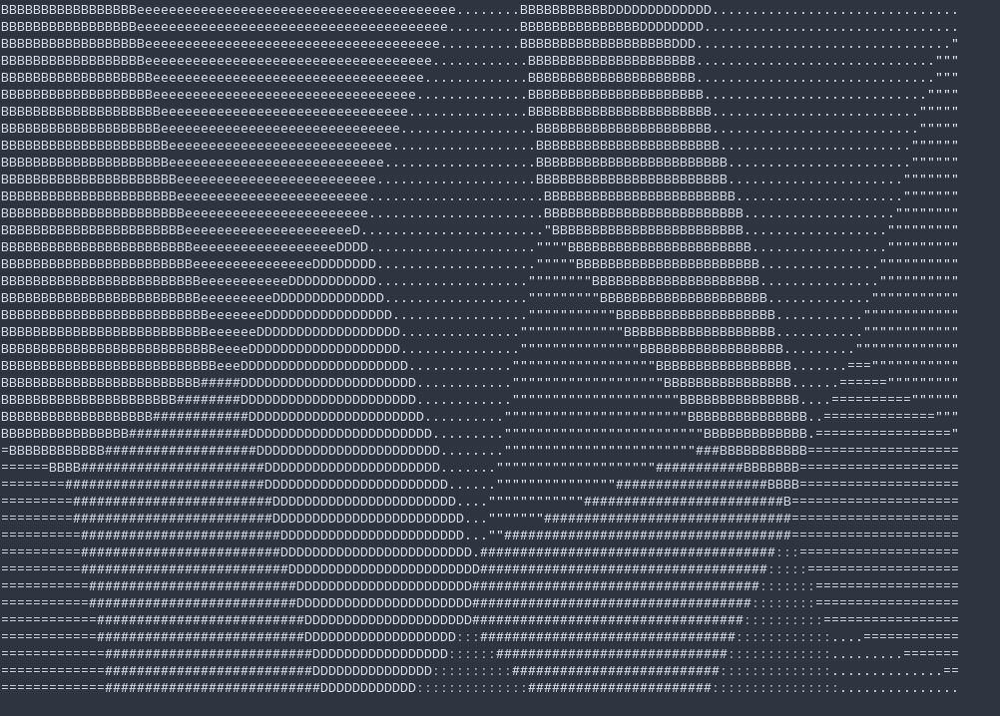

# Clani

Clani is a commandline program for any Linux distro written in C/C++, which can display different (noise) algorithms and effects with ascii characters using ncurses. This allows for some cool scrolling patterns and other animation effects.
The purpose of this project is not well defined and just something I work on by the side for fun.

### Scrolling Cellular Voronoi Pattern

### Scrolling Simple Voronoi Pattern

## Setup
Here I'm providing a little explanation on how to get clani running on your system:
### Dependencies
The project uses ***CMake v3.7.2*** and C++14. Requires ***ncurses*** and ***glm*** library!
#### CMake-3.7.2
**Arch Linux distros:**
> $ sudo pacman -S cmake

**Debian distros:**
> $ sudo apt-get install cmake

#### ncurses
**Arch Linux distros:**
> $ sudo pacman -S ncurses

**Debian distros:**
> $ sudo apt-get install libncurses5-dev libncursesw5-dev

#### glm
**Arch Linux distros:**
> $ sudo pacman -S glm

**Debian distros:**
> $ sudo apt-get install libglm-dev

### Building
Clone the repository or download the zip file into a directory of your choice
> $ git clone https://github.com/hu-ry/CLiAni.git

Generate build files in the ${build-root} directory you cloned the repository to
> $ cd ${build-root}

> $ cmake -E make_directory build

> $ cmake -E chdir build cmake ..

> $ cmake -DCMAKE_BUILD_TYPE=Release -G "CodeBlocks - Unix Makefiles" ${build-root}

Building the binary in ${build-root}/build directory
> $ cmake --build ${build-root}/build --target clani -- -j 4

And you are DONE! The executable should be in ${build-root}/build as "clani".
